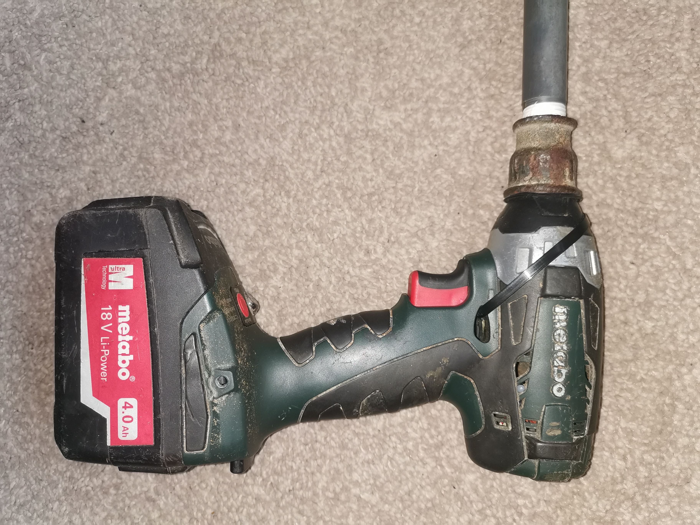
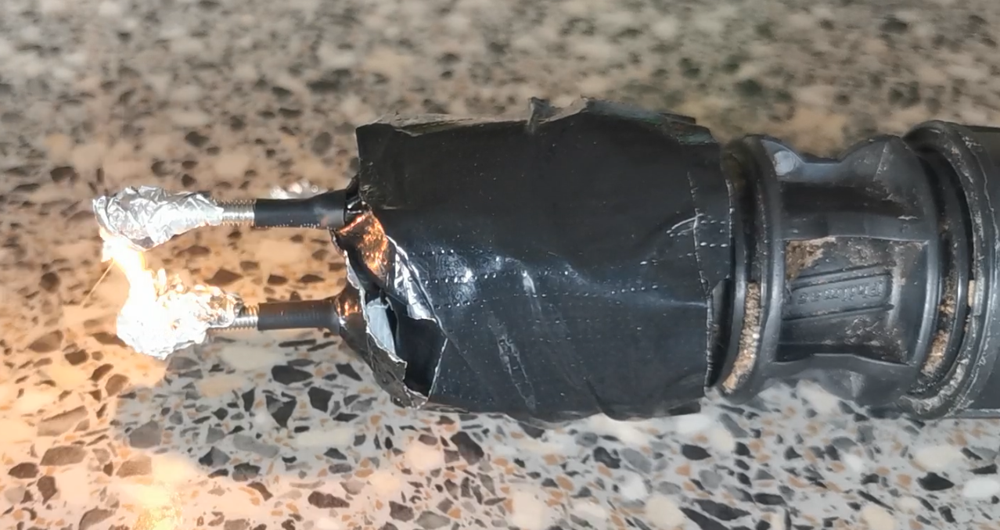
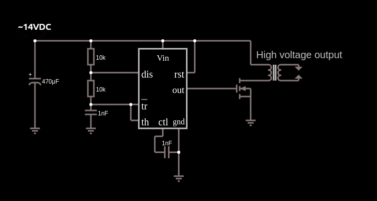

# High-Voltage-Tool
A tool containing a circuit which drives a step-up transformer at a high frequency in order
to produce high voltage, high temperature continuous plasma arcs, acting as
an effective ignitor.

An arrangement of high voltage capacitors and diodes on the secondary allows
for louder,pulsating, higher current arcs.

A broken cordless impact driver was repurposed to act as an enclosure.

## How does it work?
The battery of the tool provides 18v (nominal) to the circuit.
This is reduced using a step down converter to ~14v to prevent
excessive power damaging the step-up transformer.

The driver of the transformer and a piezo buzzer receive ~14v when the switch
is pressed. High temperature plasma arcs ~11mm long are then observed on the 
secondary of the transformer.

The driver uses a 555 timer configured to produce high frequency waves to an
N channel MOSFET on the primary of the transformer.
